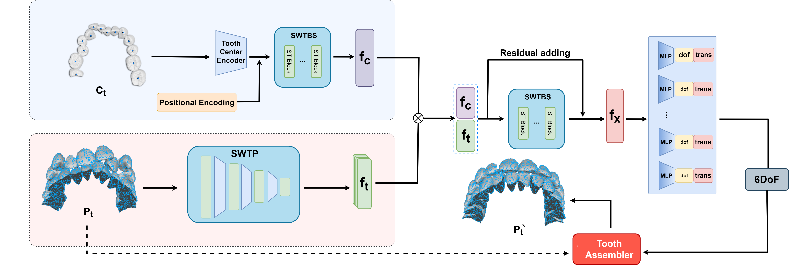
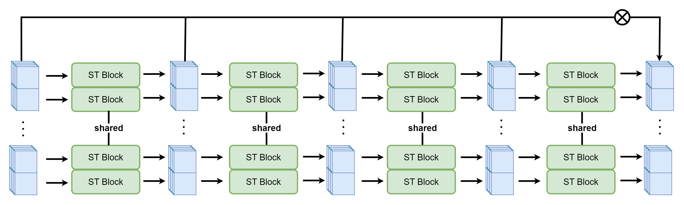
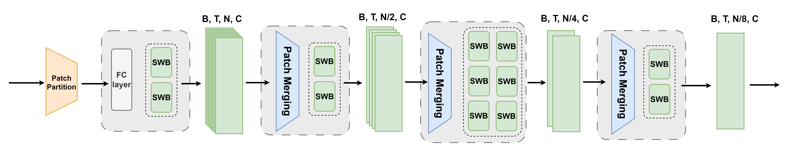

# Transformer-based Tooth Alignment Prediction with Occlusion and Collision Constraints

The planning of digital orthodontic treatment requires providing tooth alignment, which relays clinical experiences heavily and consumes a lot of time and labor to determine manually. In this work, we proposed an automatic tooth alignment neural network based on Swin-transformer. We first re-organized 3D point clouds based on dental arch lines and converted them into order-sorted multi-channel textures, improving both accuracy and efficiency. We then designed two new orthodontic loss functions that quantitatively evaluate the occlusal relationship between the upper and lower jaws. They are important clinical constraints, first introduced and lead to cutting-edge prediction accuracy. To train our network, we collected a large digital orthodontic dataset in more than 2 years, including various complex clinical cases. We will release this dataset after the paper's publishment and believe it will benefit the community. Furthermore, we proposed two new orthodontic dataset augmentation methods considering tooth spatial distribution and occlusion. We compared our method with most SOTA methods using this dataset, and extensive ablation studies and experiments demonstrated the high accuracy and efficiency of our method. 

Compared with other related studies, we have tried a very concise approach to achieve the same or even better tooth arrangement results with lower cost and time. This idea of solving the 3D tooth arrangement problem using 2D vision methods may inspire future research in this field.

I would also like to express my sincere gratitude to [@yeyuxmf](https://github.com/yeyuxmf) and [@ziyangyeh](https://github.com/ziyangyeh) for their strong support and help. The discussions with you have greatly benefited me. Thanks to [@TADPM](https://github.com/lcshhh/TADPM) for providing the amazing open-source code!

To summarize, our contributions are as follows:

- A lightweight tooth alignment network based on Swin-T is designed to replace traditional 3D point cloud feature extraction encoders. It organizes scattered point clouds into regularly sized and orderly sorted multi-channel texture forms, ensuring high efficiency and seamless compatibility with complex scenarios such as missing teeth and wisdom teeth, surpassing the accuracy of the SOTA method in tooth alignment.
- Two occlusal loss functions, the occlusal projecting overlap loss and occlusal distance uniformity loss, are designed based on medical domain knowledge. These functions enable more accurate and efficient quantitative measurement for the occlusal relationship between the upper and lower jaws.
- An extensively annotated orthodontic alignment dataset, tailored to better suit the requirements of orthodontists, has been labeled. It will be released after the paper's publishment and benefits the community. Additionally, two new orthodontic data augmentation methods considering tooth spatial distribution and occlusion are proposed to further increase the scale of training data.

# Dependence

1. CUDA: 11.x(11.2)

2. Python: 3.8.x(3.8.17)

3. Pytorch: 1.7.1

4. Pytorch3d: 0.3.0

5. Scikit-learn: 1.3.1

6. TIMM: 0.3.2

7. VTK: 9.2.6

8. Numpy: 1.24.3

# Reference Paper:
1. TANet: Towards Fully Automatic Tooth Arrangement.
2. Tooth Alignment Network Based on Landmark Constraints and Hierarchical Graph Structure.
3. Automatic Tooth Arrangement with Joint Features of Point and Mesh
Representations via Diffusion Probabilistic Models
4. Swin Transformer: Hierarchical Vision Transformer using Shifted Windows

# Renference Code:
1. https://github.com/yeyuxmf/auto_tooth_arrangement
1. https://github.com/microsoft/Swin-Transformer
4. https://github.com/ziyangyeh/TANet-Pytorch
4. https://github.com/lcshhh/TADPM
5. https://github.com/facebookresearch/mae
6. https://github.com/liucongg/GPT2-NewsTitle
7. https://github.com/jadore801120/attention-is-all-you-need-pytorch
8. https://github.com/graykode/nlp-tutorial
9. https://github.com/openai/gpt-3

# Usage
1. Data Processing:
python ./data/data_processing.py
2. Data enhance:
python ./data/data_enhance.py
3. Train:
python main.py
4. Test:
python test_rotate.py
